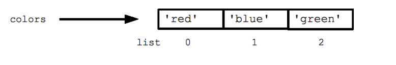

import { Aside } from "@astrojs/starlight/components";

<Aside type="note" title="Info">
  💻 Welcome to the crash course on python. This tutorial will help you get
  started with python. These are the same resources used for the training I
  provided while working at International Maize and Wheat Improvement Center
  (CIMMYT) Nepalgunj.
</Aside>

# Installation

One of the Easy ways of Installing python is through Anaconda Distribution.

- Easy to Install
- Contains Various Packages for Analytics and Data Science (DS)
- Easy to Manage Environments and Packages

# Environments

An Environment is an isolated workspace with specific packages and tools.

🤷‍♂️ But why do I need it?

- Because it helps:
- Avoiding version conflicts between projects
- Reproducibility of research and data analysis
- Easier collaboration and sharing of code
- Seamless transition between different projects

## Creating and Managing Environments

[Anaconda](https://docs.anaconda.com/free/navigator/tutorials/manage-environments/)

# Making Comments / Docstrings

In programming, comments and docstrings are two distinct ways of adding explanatory text or documentation within the code.

## Comments

Comments are used to explain what the code is doing, making it easier for others (and yourself at a later date) to understand the purpose and functionality of your code. They are completely ignored by the Python interpreter, meaning they have no effect on the execution of the program.

In Python, comments are indicated by a hash symbol (**`#`**). Everything following the **`#`** on that line is part of the comment.

```python
# This is a single-line comment
print("Hello, World!") # This comment is inline with code
# Comments can be used to temporarily disable code
# print("This won't run")
```

## Docstrings

Docstrings, or documentation strings, serve a similar purpose but are used for a different scope. They are used to describe what a function, class, method, or module does. Unlike comments, docstrings are stored as a part of the object they document and can be accessed at runtime using the **`.__doc__`** attribute. This makes them accessible to various documentation-generation tools and for introspection.

In Python, docstrings are enclosed in triple quotes (**`"""`** or **`'''`**). They are typically found right under the definition of a function, class, method, or at the beginning of a module.

```python
def add(a, b):
    """
    This function adds two numbers and returns the result.

    Parameters:
    a (int): First number
    b (int): Second number

    Returns:
    int: The sum of a and b
    """
    return a + b

print(add.__doc__)  # This will print the docstring of the function
```

# Variables, Constants and Key Words

## Variables

Variables are name storage location for storing your data.

<Aside type="note" title="Info">

Think of it as a container 🥫, and you can store various type of foods in those containers like 🥚 🥔 🍗 🍎 🍺

</Aside>
Now how do we add our apple to this container?
Here comes the mighty `=` operator

### Assigning value to a Variable

```python
# assiging value to a variable magic_number
magic_number = 100
```

This chunk is known as a command or a program. Now to get something out of this command we first need to execute it. Just like closing a lid of your container we talked about.

To get the value of this variable you need to simply call it:

```python
magic_number
```

### Assigning values to multiple variables

```python
a,b,c = 1,"Hello",True
```

## Constants

Constants are special type of variables which do not change in a program. They are generally assigned at the top a program. Constants are written in Uppercase to distinguish them from variables.

```python
# assigning a value to a constant
PI = 3.14
```

## Keywords: The Building Blocks

Keywords in Python are reserved words that have special meanings and purposes. They cannot be used as identifiers (variable or constant names).
Examples:

- **`if`**, **`else`**, **`elif`** - Used for conditional statements.
- **`for`**, **`while`** - Used for looping.
- **`break`**, **`continue`** - Used inside loops to alter their normal behavior.
- **`def`**, **`return`** - Used in defining functions.
- **`class`**, **`import`**, **`from`** - Used in object-oriented programming and modules.
- **`True`**, **`False`**, **`None`** - Representing Boolean values and the null object.

<Aside type="caution" title="Avoiding Conflicts">

- Do not use these keywords as variable names. For example, **`if = 5`** is not valid.
- Trying to use a keyword as an identifier will result in a syntax error.

</Aside>

## Dynamic typing in action

In python unlike many other languages has dynamic typing.

<Aside type="note" title="What is dynamic typing you may say?">
  well, it means variable data types are automatically determined during
  compilation and can be reassigned to different type of values during runtime.
  Think of it as a magic container 🪄. Imagine you can change an apple to an egg
  and vice versa inside your container.
</Aside>

```python
# Dynamic Typing
variable_1 = 5 print("Variable 1:", variable_1, "Type:", type(variable_1))
# Reassigning varaible_1
variable_1 = "Hello, Python!"
print("Variable 1:", variable_1, "Type:", type(variable_1))
```

# Printing

Let’s see different ways to print something:

## Printing variables and strings

```python
something= "This can be string"
# Printing a variable/constants
print(something)
# Printing a string
print("This is a string")
```

## Printing Both Variables and Strings

```python
name= "Sankalpa"
print('My name is', name, 'and I am', 22)
# printing '
print("Let's go.")
```

## f-strings

```python
name = 'Sankalpa'
age = 22
print(f"Hello, My name is {name} and I'm {age} years old.")
```

<Aside type="caution" title="Warning">
  Note: Python is case-sensitive `A` and `a` are different. For example: > `A =
  5` and `a = 5` are different
</Aside>
# Data Types in Python

## Number

A number can be of:

- Int
- float
- complex
  How do I know what’s the type of my data?
  `type()` function helps to identify the type of your data. Here’s how you can use this function.

```python
variable_1 = 1000
print(type(variable_1))
variable_2 = 1000.007
print(type(variable_2))
variable_3 = 2+5j
print(type(variable_3))
```

## String

Strings are sequence of characters enclosed by single quotes `‘` or double quotes `“`.
To add quotes as part of the string itself, it should be the child of double or single quotes for one other. Or you can use backslash `\\'` or `\\"`for adding quotes. For example: `“Let’s Go”` `'Let”s go'` `”Let\\”s go”`

Let’s see this in action:

```python
print("let's go")
print('let"s go')
print("Let\"s go")
```

<Aside type="caution" title="Warning">
  But be careful mismatching quotes gives syntax error
</Aside>

```python
print("Hello')

# This gives us unterminated string literal error.
# i.e "Hello should be terminated by " not ' and same applies for 'Hello
```

### Some Useful String methods

`capitalize()`
The `capitalize()` method return the Capitalized string.

```python
name="hello"
print(name.capitalize)
# Outputs:  Hello
```

`strip()`
The `strip()` method removes any leading, and trailing whitespaces. Leading means at the beginning of the string, trailing means at the end. You can specify which character(s) to remove, if not, any whitespaces will be removed.

```python
dummy= ",,,,,las.....sankalpa....lla"
dummy_strip = dummy.strip(",.sal")
dummy_strip
```

This outputs `nkalp` but how. This may seem confusion.
Let me explain `dummy.strip(",.sal")` here `,.sal` is a set . Now strip first starts stripping from leading portion for all characters that match `,.sal` when it reaches `n` that is not on the set it stops and starts from the trailing portion of the string, when it reaches `p` it stops and now we are left with `nkalp`

`lower()`
The `lower()` method returns the string where all the characters are lowercase.

```python
name= "SanKALpa"
lower_case = name.lower()
print(lower_case)
```

`upper()`
The `upper()` method returns the string where all the characters are uppercase.

```python
name= "SanKALpa"
upper_case = name.upper()
print(upper_case)
```

`replace()`
The `replace()` method replaces a specified word with another from a string.

```python
my_string = "Here bananas means many and a banana means one.\nBut Here replace method can replace BananasMangobananaspeach "

replaced_string = my_string.replace("bananas", "apples")

print(replaced_string)
```

## List

<Aside type="caution" title="Warning">
  In Python, an index refers to the position of an element within an iterable
  object, like a list, string, tuple, etc. Python uses zero-based indexing,
  meaning the first element is at index 0, the second element is at index 1, and
  so on.
</Aside>

A list in Python is a dynamic array that can contain items of different types. Lists are ordered, changeable (mutable), and allow duplicate elements.

### Creating a List:

Lists are created using square brackets `[]` or the `list()` constructor.

```python
# using square brackets []
colors= ["red","blue", "green"]
# using list() constructor
colors= list(["red","blue", "green"])
```



### Accessing List Elements:

Items in a list can be accessed by their `index`, starting from `0`.

```python
colors[0] # gives red
colors[1] # gives blue
colors[2] # gives green
```

But what happens when we go beyond 2 in colors index?

```python
colors[3]
colors[1000000]
```

we get an error saying: `IndexError: list index out of range`

<Aside type="note" title="Remember">
  In python `Index` starts from `Zero 0` But `Length` starts from `One 1`
</Aside>

### Modifying List

Lists are mutable. You can change, add, and remove items.

```python
# Changing an item
colors[1] = "yellow"

# Adding items
colors.append("black")
colors.extend(["white", "cyan", "red"])

# Removing items
colors.remove("cyan")  # Removes 'cyan' | If multiple it removes the first one it finds
del colors[0]  # Removes the first item
```

### Iterating List

List can be iterated using `for` loop:

```python
for color in colors:
    print(color)
```

### Useful List Methods:

- **`append()`**, **`extend()`**, **`insert()`**: For adding items.
- **`remove()`**, **`pop()`**, **`clear()`**: For removing items.
- **`index()`**, **`count()`**: For searching the list.
- **`sort()`**, **`reverse()`**: For sorting and reversing the list.

## Tuples

A tuple in Python is an ordered, immutable (unchangeable) collection of items. Tuples are created using parentheses `()` or the `tuple()` constructor.

### Creating a Tuple

Tuples can be created with or without parentheses.

```python
coordinates = (3.5, 7.2)
fruits = "apple", "banana", "cherry"
mixed_tuple = (1, "Hello", 3.14)
single_item_tuple = (42,)  # Note the comma for a single-item tuple
```

### Accessing Tuple Elements

Items in a tuple are accessed by their index, starting from 0.

```python
x_coordinate = coordinates[0]  # 3.5
second_fruit = fruits[1]  # 'banana'
```

### Immutability of Tuples

Once a tuple is created, its elements cannot be changed, added, or removed.

```python
# This will result in an error
coordinates[0] = 4.0
```

### Iterating Through a Tuple

Similar to lists, tuples can be iterated over using a **`for`** loop.

```python
for fruit in fruits:
    print(fruit)
```

## Sets

A set in Python is an unordered collection of unique items. Sets are created using curly braces `{}` or the `set()`constructor.

### Creating a Set

Sets automatically remove duplicates and are unordered.

```python
colors = {"red", "blue", "green"}
numbers = set([1, 2, 2, 3, 4, 4, 4])
empty_set = set()
```

### Accessing Set Elements

Set items cannot be accessed by an index or key since sets are unordered. To access items, one must loop through the set or ask if a value is present.

```python
for color in colors:
    print(color)

if "red" in colors:
    print("Red is in the set")
```

### Modifying Sets

Sets are mutable. You can add or remove items.

```python
# Adding items
colors.add("yellow")

# Removing items
colors.remove("blue")  # Raises KeyError if not found
colors.discard("green")  # Does not raise an error if not found
```

### Set Operations:

Sets are ideal for mathematical operations like union, intersection, difference, etc.

```python
a = {1, 2, 3}
b = {3, 4, 5}

union_set = a | b  # {1, 2, 3, 4, 5}
intersection_set = a & b  # {3}
difference_set = a - b  # {1, 2}
# a - b is equal to the elements present in A but not in B
symmetric_difference = a ^ b  # {1, 2, 4, 5}
```

## Dictionary

A dictionary in Python is an unordered collection of key-value pairs. Dictionaries are created using curly braces **`{}`** with keys and values.

### Creating a Dictionary

Each key-value pair in a dictionary is separated by a colon **`:`**, and pairs are separated by commas.

```python
person = {"name": "Sankalpa", "age": 22, "city": "Nepalgunj"}
phone_numbers = {"Sankalpa": "9867335759", "Police": "100"}
empty_dict = {}
```

### Accessing Dictionary Elements

Values can be accessed using their keys.

```python
name = person["name"]  # "Sankalpa"
sankalpa_phone = phone_numbers["Sankalpa"]  # "9867335759"
```

Accessing a non-existent key result in a `KeyError`. The `get(`) method is a safer way to access values, as it returns `None` (or a specified default) if the key is not found.

```python
age = person.get("age")  # 22
salary = person.get("salary", 0)
# Returns value if salary is present or 0 as 'salary' is not a key
```

### Modifying Dictionaries

Dictionaries are mutable. You can add, change, or remove key-value pairs.

```python
# Adding or updating
person["city"] = "Palpa"
person["profession"] = "Engineer"

# Removing items
del person["age"]
phone_numbers.pop("Police")
```

### Iterating Through a Dictionary

You can iterate over keys, values, or key-value pairs.

```python
for key in person:
    print(key, person[key])

for key, value in person.items():
    print(key, value)
```

# Loops in Python

## For Loops

To repeat a Task for a specified number of times.

```python
Employees= ['Sankalpa', 'Hemaraj', 'Amrit']

# access items of a list using for loop
for i in Employees:
    print(i)
```

### Using `range()`

```python
# iterate from i = 0 to i = 3
for i in range(4):
    print(i)
```

## While loop

The loop continues to execute the block of code as long as the specified condition remains true. Once the condition becomes false, the loop exits, and the program continues with the next statement after the `while` loop.

```python
count = 0

while count < 5:
    print("Count is:", count)
    count += 1  # Increment the count variable

print("Loop finished")
```

<Aside type="caution" title="Warning">
  It's important to be cautious while using while loops to avoid infinite loops.
  An infinite loop occurs when the loop condition never becomes false, leading
  to the code inside the loop executing indefinitely. To prevent this, ensure
  that the loop condition will eventually become false based on the logic of
  your program.
</Aside>

```python
# Infinite loop
while True:
    print("This is an infinite loop")
```

To break out of a loop prematurely, you can use the `break` statement

```python
count = 0

while True:
    print("Count is:", count)
    count += 1

    if count >= 5:
        break  # Exit the loop when count is equal to or greater than 5
```

# If Else..

```python
number = 10

if number > 0:
    print('Positive number')

else:
    print('Negative number')

print('This statement always executes')
```

# If elif else…

```python
number = 0

if number > 0:
    print('Positive number')

elif number <0:
    print('Negative number')

else:
    print('Zero')

print('This statement is always executed')
```

# Functions

In Python, a function is a block of reusable code that performs a specific task. Functions provide modularity and help organize code by breaking it into smaller, manageable pieces.

```python
def function_name(parameters):
    # Code block
    # Perform some task
    return result  # Optional return statement
```

- **`def`** is the keyword used to define a function.
- **`function_name`** is the name of the function.
- **`parameters`** are input values that the function can accept (optional).
- The colon (**`:`**) indicates the start of the function code block.

```python
def add_numbers(a, b):
    sum_result = a + b
    return sum_result
```

you can call this function by providing necessary arguments.

```python
result = add_numbers(3, 5)
print(result)  # Output: 8
```

### Default Parameters

You can provide default values for function parameters, making them optional

```python
def greet(name, greeting="Hello"):
    print(f"{greeting}, {name}!")

greet("Alice")  # Output: Hello, Alice!
greet("Bob", "Good morning")  # Output: Good morning, Bob!
```

In this example, the **`greeting`** parameter has a default value of "Hello." If a value is provided for **`greeting`**, it will use that value; otherwise, it will default to "Hello."

### Variable Number of Arguments

You can use **`*args`** to allow a variable number of arguments:

```python
def sum_all(*args):
    return sum(args)

result = sum_all(1, 2, 3, 4, 5)
print(result)  # Output: 15
```

Here, **`*args`** allows the function to accept any number of arguments, and **`sum(args)`** sums them up.

### Keyword Arguments

You can use keyword arguments for better readability

```python
def display_info(name, age):
    print(f"Name: {name}, Age: {age}")

display_info(age=25, name="Alice")
```

### Return Statement

Functions can return values using the **`return`** statement. If no **`return`** statement is present, the function returns **`None`** by default.

```python
def multiply(a, b):
    result = a * b
    return result

product = multiply(3, 4)
print(product)  # Output: 12
```

### Docstrings

You can include a docstring to document your function

```python
def square(number):
    """
    This function squares the input number.
    """
    return number ** 2
```

Docstrings are triple-quoted strings at the beginning of a function, providing documentation for the function's purpose, parameters, and return values.

Understanding functions is fundamental in Python programming, as they allow you to create reusable and organized code.
