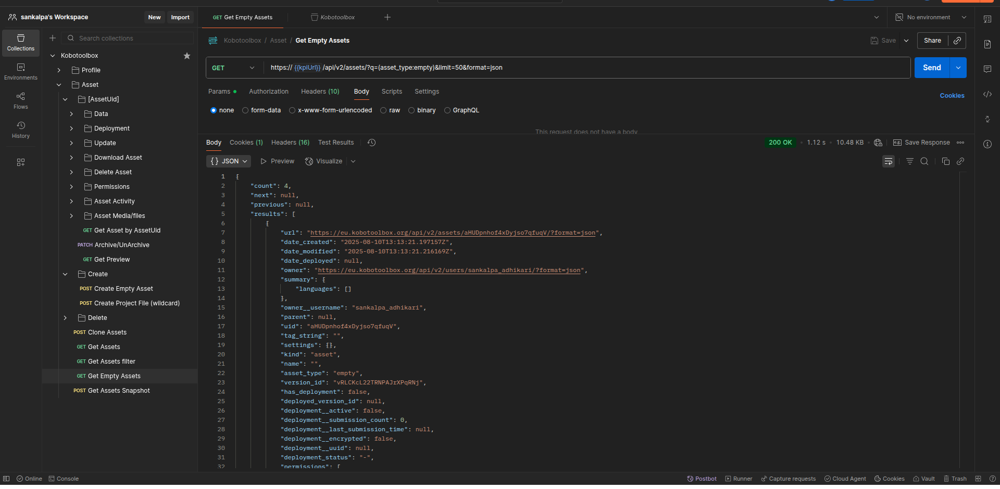
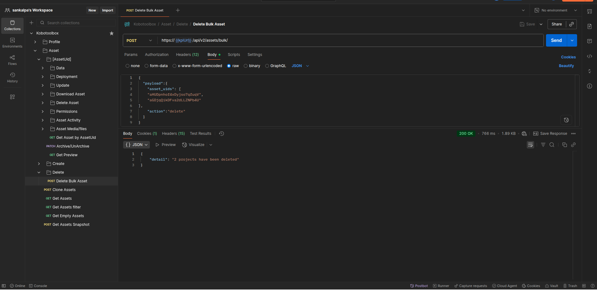

import { Tabs, TabItem } from "@astrojs/starlight/components";
import { Steps } from "@astrojs/starlight/components";
import { Aside } from "@astrojs/starlight/components";

<Aside type="note" title="Who you gonna call?">

> Apparently… yourself.  
> Because your KoboToolbox might be haunted by **invisible ‘empty’ assets** lurking in the shadows.

</Aside>

I have been using Kobotoolbox for more than a year now and and I'm a huge fan of its power and flexibility. The API, in particular, is a fantastic feature for anyone looking to build custom solutions or automate data workflows.

But recently, I stumbled upon a spooky little quirk: your account could be **quietly haunted by ghost assets** that the UI never shows you.  
Let’s suit up, fire up the PKE meter, and track these phantoms.

## 👻 The Ghost in the Machine: How They Spawn

The issue stems from the sequence of API calls KoboToolbox makes when you import an XLSForm from a URL. Let's trace the process you trigger when clicking `New --> Import an XLSForm via URL` while normally harmless, can accidentally open a ghost portal.

<Steps>

1. The Spawn: **An Empty Asset**

   First, KoboToolbox optimisticly creates a placeholder for your new form.

   ```bash
   POST https://[kpi_url]/api/v2/assets/

   ```

   This request immediately creates an asset with a unique ID (e.g., aHUDpnhof4xDyjso7qfuqV) before it even tries to fetch your form.

2. The Summoning : **Import Attempt**

   Next, it attempts to import your XLSForm into the newly created asset and returns `import_uid` and `import_url`.

   ```bash
   POST https://[kpi_url]/api/v2/imports/
   ```

3. The PKE Scan : **Status Check**

   Finally, the frontend polls the import status to see if it succeeded.

   ```bash
   GET https://[kpi_url]/api/v2/imports/[import_uid]/
   ```

</Steps>

Here's the catch: `Step 1` succeeds and creates an empty asset regardless of whether your XLSForm URL is valid. If the URL is broken or incorrect, `Step 2` will eventually fail to import, but the empty asset from `Step 1` remains in your account, orphaned, floating unseen by mortal eyes..

You might be thinking,

> **_"I've checked my project list, and there are no empty assets. What are you talking about?"_**

## 🕵️ Why You Can’t See Them

You're right they aren't visible. The KoboToolbox UI specifically filters your project list to show only assets of the type `survey`. The API call your browser makes looks like this:

```bash
GET https://[kpi_url]/api/v2/assets/?q=(asset_type:survey)&ordering=_deployment_status&limit=50
```

However, KoboToolbox supports several asset types, including: `survey`, `question`, `template`, `block`, `collection`, and the elusive `empty` (the ones we’re after).

## 🔍 Ghost Hunt: Finding the Empty Assets

You can easily check for these hidden assets using an API client like Postman, Insomnia, or even a simple curl command.

You'll need your KoboToolbox server URL, i.e `kpi_url` (https://kf.kobotoolbox.org or https://eu.kobotoolbox.org for most users) and your API token, which you can find in your account settings.

<Tabs syncKey="language">
  <TabItem label="Curl">

    ```bash
    # Replace [kpi_url] and [your_api_token] with your details
    curl -X GET 'https://[kpi_url]/api/v2/assets/?q=(asset_type:empty)&limit=50&format=json' \
    -H 'Authorization: Token [your_api_token]'
    ```

  </TabItem>
  <TabItem label="Python">

```python
import requests

  # Replace these with your actual values

kpi_url = "your_kpi_url"
api_token = "your_api_token"

url = f"https://{kpi_url}/api/v2/assets/?q=(asset_type:empty)&limit=50&format=json"
  headers = {
  "Authorization": f"Token {api_token}"
  }

response = requests.get(url, headers=headers)

if response.status_code == 200:
  print(response.json())
else:
  print(f"Error: {response.status_code} - {response.text}")

```

</TabItem>
  <TabItem label="Javascript">

```js
// Replace these with your actual values
const kpiUrl = "your_kpi_url";
const apiToken = "your_api_token";

const url = `https://${kpiUrl}/api/v2/assets/?q=(asset_type:empty)&limit=50&format=json`;

fetch(url, {
  method: "GET",
  headers: {
    Authorization: `Token ${apiToken}`,
  },
})
  .then((response) => {
    if (!response.ok) {
      throw new Error(`HTTP error! Status: ${response.status}`);
    }
    return response.json();
  })
  .then((data) => {
    console.log(data);
  })
  .catch((error) => {
    console.error("Request failed:", error);
  });
```

</TabItem>

<TabItem label="Postman">
  

</TabItem>
</Tabs>

If you get an empty array `[]`, you’re ghost-free. <br/>
If not..., you've found some ghosts!

## 🔫 Time to Bust ‘Em

Like any seasoned Ghostbuster, we’ll trap and get rid of them in a two-step process.

<Steps>
1. Collect the Ghost UIDs (Empty Assets)

    Run the similar command above again, but this time, you'll want to gather all the uid values from the response. You can increase the limit parameter to get more results at once.
    <Tabs syncKey="language">

      <TabItem label="Curl">

      ```bash
      # Replace [kpi_url] and [your_api_token] with your details
      curl -X GET 'https://[kpi_url]/api/v2/assets/?q=(asset_type:empty)&limit=50&format=json' \
      -H 'Authorization: Token [your_api_token]' \
      | jq '[.results[].uid]'

      ```
    </TabItem>
    <TabItem label='Python'>

    ```python
    import requests

    # Replace these with your actual values

    kpi_url = "your_kpi_url"
    api_token = "your_api_token"

    url = f"https://{kpi_url}/api/v2/assets/?q=(asset_type:empty)&limit=50&format=json"
    headers = {
      "Authorization": f"Token {api_token}"
      }

    response = requests.get(url, headers=headers)

    if response.status_code == 200:
      data = response.json()
      uid_list = [asset.get("uid") for asset in data.get("results", [])]
      print(uid_list)
    else:
      print(f"Error: {response.status_code} - {response.text}")
    ```
    </TabItem>

    <TabItem label="Javascript">

    ```js
    // Replace these with your actual values
    const kpiUrl = "your_kpi_url";
    const apiToken = "your_api_token";

    const url = `https://${kpiUrl}/api/v2/assets/?q=(asset_type:empty)&limit=50&format=json`;

    fetch(url, {
      method: "GET",
      headers: {
        Authorization: `Token ${apiToken}`,
      },
    })
      .then((response) => {
        if (!response.ok) {
          throw new Error(`HTTP error! Status: ${response.status}`);
        }
        return response.json();
      })
      .then((data) => {
        const uidList = data.results.map(asset => asset.uid);
        console.log(uidList);
      })
      .catch((error) => {
        console.error("Request failed:", error);
      });
    ```

    </TabItem>

    <TabItem label="Postman">
      

    </TabItem>

    </Tabs>

2.  Fire the Proton Pack (Bulk Delete)

    With the list of UIDs, you can use the bulk delete endpoint to remove them all in a single API call.

        <Tabs syncKey="language">

    <TabItem label="Curl">

              ```bash
              # Replace [kpi_url] and [your_api_token] with your details and asset_uids from step 1
              curl -X POST 'https://[kpi_url]/api/v2/assets/bulk/' \
              -H 'Authorization: Token [your_api_token]' \
              -H 'Content-Type: application/json' \
              -d '{
              "payload": {
                "asset_uids": [
                  "aHUDpnhof4xDyjso7qfuqV",
                  "aGDjqQikDFva2dLLZNPb4U",
                ],
                "action": "delete"
              }
              }'

              ```

            </TabItem>

        <TabItem label="Python">

    ```python
    import requests

    # Replace with your actual values and asset_uids from step 1
    kpi_url = "your_kpi_url"
    api_token = "your_api_token"

    url = f"https://{kpi_url}/api/v2/assets/bulk/"
    headers = {
      "Authorization": f"Token {api_token}",
      "Content-Type": "application/json"
    }
    data = {
      "payload": {
          "asset_uids": [
              "aHUDpnhof4xDyjso7qfuqV",
              "aGDjqQikDFva2dLLZNPb4U",
          ],
          "action": "delete"
      }
    }

    response = requests.post(url, headers=headers, json=data)

    if response.status_code == 200:
      print("Success:", response.json())
    else:
      print(f"Error {response.status_code}: {response.text}")

    ```

            </TabItem>

        <TabItem label="Javascript">

    ```js
    // Replace with your actual values and asset_uids from step 1
    const kpiUrl = "your_kpi_url";
    const apiToken = "your_api_token";

    const url = `https://${kpiUrl}/api/v2/assets/bulk/`;
    const payload = {
      payload: {
        asset_uids: ["aHUDpnhof4xDyjso7qfuqV", "aGDjqQikDFva2dLLZNPb4U"],
        action: "delete",
      },
    };
    fetch(url, {
      method: "POST",
      headers: {
        Authorization: `Token ${apiToken}`,
        "Content-Type": "application/json",
      },
      body: JSON.stringify(payload),
    })
      .then((response) => {
        if (!response.ok) {
          throw new Error(`HTTP error! Status: ${response.status}`);
        }
        return response.json();
      })
      .then((data) => {
        console.log("Success:", data);
      })
      .catch((error) => {
        console.error("Request failed:", error);
      });
    ```

            </TabItem>

          <TabItem label="Postman">
          

          </TabItem>

      </Tabs>

    Just replace the asset_uids array with the UIDs you collected.

</Steps>

## 🛡 Prevent Future Hauntings

Until KoboToolbox adjusts this workflow, you can adopt a few practices:

- **Validate URLs Before Importing:** The simplest defense is prevention. Double-check that your XLSForm URL is correct and accessible before hitting the import button.

- **Perform Regular Cleanups:** Schedule a quarterly or monthly check-up. Running the GET command from above takes only a minute and can keep your account tidy.

- **Automate with Post-Import Validation:** If you're building automated workflows that import forms via the API, add a validation step. If an import fails, have your script automatically call the DELETE endpoint for the empty asset that was just created.

## 🎯 Final thoughts

For most users on KoboToolbox's generous community plan (which allows unlimited projects), these ghost assets are harmless and will likely go unnoticed. However, for users who self-host KoboToolbox, this can lead to unnecessary database bloat over time. In that scenario, keeping the assets table clean is a good maintenance practice. A simple cron job that runs a cleanup script periodically could be an elegant solution.

A little proactive ghostbusting keeps your account lean, your database happy, and your PKE meter quiet.

> So next time your import fails, remember:
>
> There’s probably a little “Slimer” floating around in your KoboToolbox…
>
> and now you know how to trap it.
