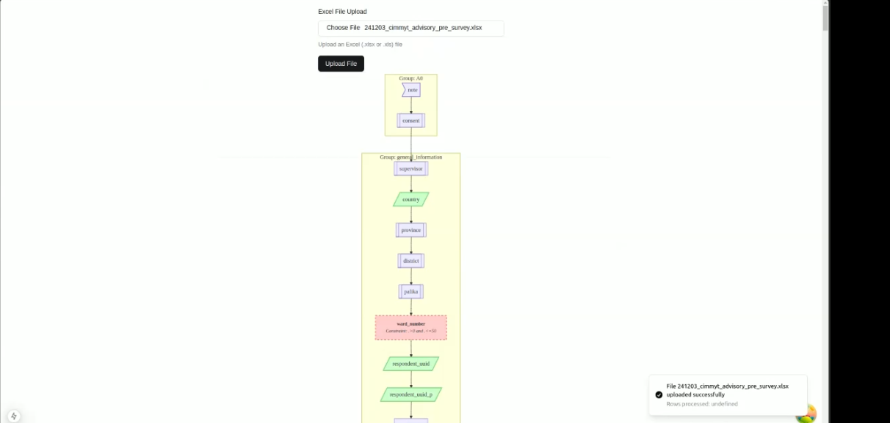

## Overview

KoboBifrost Visualizer is a web application being developed using React and [Tldraw](https://tldraw.dev/) to help visualize XLSForms as interactive flowcharts. This tool aims to address the challenges faced during XLSForm preparation.

## History and Motivation

Everyone learns from mistakes, and like anyone else, I do too. While working as a consultant on a research project at CIMMYT, I was responsible for designing an XLSForm for a survey. The number of questions was large, and the rows in the XLSForm reached the thousands. With tight deadlines and all, I missed a constraint on one of the questionnaires, and it slipped through testing.

In production, I was notified by the enumerators, and I immediately pushed an update to fix it. This experience made me realize the need for a graphical solution to visualize the XLSForm during development, allowing me to catch such issues beforehand.

## Staytuned

I have explored various solutions like Excalidraw, MxGraph, Graphviz, and Tldraw, and I am currently experimenting with Tldraw.

_Here is a simple prototype flowchart I made using Graphviz and ReactJS. Since it lacked interactivity, I am now exploring Tldraw._

Meanwhile, feel free to checkout other amazing project like [KoboBifrost CLI](../../projects/kobobifrost-cli) and [KoboBifrost Upload](../../projects/kobobifrost-upload) .
